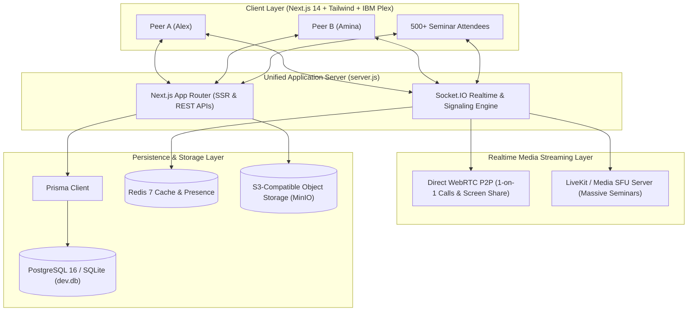

# pixelmink — Peer Knowledge Protocol

> **“Your skills for theirs. No money, just knowledge.”**
> Repository: [https://github.com/sasahokage67/pixelmink](https://github.com/sasahokage67/pixelmink)
> A production-grade educational platform for reciprocal tech knowledge exchange with real WebRTC calls, screen sharing, massive broadcast seminars, and verifiable skill assessments.

---

## 1. Concept & Architectural Highlights

Traditional platforms either treat education as one-way static videos or as generic social networking. **pixelmink** implements a deterministic, reciprocal **Knowledge Exchange Protocol**:

```
MATCH → CHAT → CALL → LEARN → PRACTICE → TEST → PROGRESS
```

### Key Technical Innovations
1. **Reciprocal & Multi-Hop Matching Engine (`matchUsers(userId)`):**
   - **Direct 2-Way Matches (A ↔ B):** A teaches Python to B; B teaches English / Prompt Engineering to A.
   - **Circular Exchange Chains (A → B → C → A):** A teaches B, B teaches C, C teaches A. Ensures users can learn even without an immediate 1-on-1 bilateral fit.
2. **Deterministic Match Score:** Evaluates skill overlap, target proficiency level synergy, shared languages, timezone proximity, rating track record, and verified status.
3. **WebRTC Peer-to-Peer & Group Sessions:**
   - Real browser `MediaStream` capture via `getUserMedia`.
   - **True Screen Sharing (`getDisplayMedia`)**: Switch between screen/window/tab demonstration and camera stream dynamically.
   - Socket.IO signaling server managing SDP offers, answers, ICE candidates, and host moderation controls (mute, disable camera, hand raise).
4. **Massive Educational Seminars (SFU / Broadcast Architecture):**
   - Avoids full mesh WebRTC degradation for 500+ attendees.
   - Scalable 1:N broadcast stage (Host audio/video/screen -> SFU -> Attendees).
   - Live attendee counter, floating real-time emoji reactions, Q&A panel with live upvoting and **"Answering now"** state, pinned announcements, and attendance timer with certified credentials.
5. **Proof of Learning Quizzes:**
   - Post-session assessments with automated grading, explanations, and verifiable **+8% Knowledge Progress** increments.
6. **XCredits Knowledge Economy:**
   - 1 hour of verified teaching = +1 XCredit.
   - 1 hour of mentorship received = -1 XCredit.
   - Zero financial barriers; strictly a motivation and fair-exchange engine.

---

## 2. High-Level Architecture Diagram



---

## 3. WebRTC vs LiveKit SFU: Architectural Decisions

- **1-on-1 and Small Group Sessions (Mesh / WebRTC):** Direct peer connections with minimal latency and zero middlebox transcoding overhead.
- **Massive Seminars (100–500+ Attendees):** Traditional mesh WebRTC requires $N \times (N-1)$ connections, collapsing bandwidth. We deploy **LiveKit SFU** (Selective Forwarding Unit):
  - The Host publishes **1 video/screen track** up to the SFU server.
  - The SFU duplicates and fans out packets to hundreds of passive downstream viewers with adaptive simulcast bitrates.
  - Live chat, Q&A, and hand raising run over WebSocket channels without touching media server CPU.

---

## 4. Tech Stack

- **Frontend:** Next.js 14 (App Router, Server Components + Client interactivity), React 18, TypeScript 5.
- **Design System:** Drinkit.ru minimalist digital design DNA:
  - Primary Typography: `IBM Plex Sans` (headings & copy) + `IBM Plex Mono` (metrics, tags, code).
  - Dark Theme: Deep neutral zinc `#09090b` with subtle `rgba(255,255,255,0.08)` hairline dividers.
  - Accent Color: Tech Electric Cobalt `#2563eb` (strict rule: no lime green, no orange).
  - High information density, bento cards, tactile micro-press feedback.
- **Backend:** Node.js + Next.js Route Handlers + Socket.IO server (`server.js`).
- **ORM & Database:** Prisma ORM, SQLite for out-of-the-box zero-config local execution + full PostgreSQL schema for production.
- **Security:** bcrypt password hashing, stateless JWT cookies, strict parameter validation.

---

## 5. Local Setup & Quickstart

### Prerequisites
- Node.js v18+ and npm installed.

### Installation
```bash
# Navigate to the project root
cd C:\Users\kukus\.gemini\antigravity\scratch\xchange

# Install dependencies
npm install

# Initialize database schema and generate Prisma client
npx prisma db push

# Populate realistic seed database (18 users, 25 skills, matches, seminars, quizzes)
node prisma/seed.js

# Launch the unified Next.js + Socket.IO server
npm run dev
```

The application is now live at: **`http://localhost:3000`**

---

## 6. How to Test All Features (Zero Fake Buttons)

### 1. Test Peer Accounts (1-Click Switcher)
Click on the **"Role: Alex"** button in the top navigation bar at any time to instantly switch user contexts:
- **Alex Voronov** (`alex@xchange.dev`): Senior Python & AI Mentor.
- **Amina Al-Mansoor** (`amina@xchange.dev`): English for IT & Prompt Engineering Mentor.
- **Daniel Richter** (`daniel@xchange.dev`): Rust Systems Engineer.
- **Sara Lindqvist** (`sara@xchange.dev`): Principal UI/UX & Figma Lead.
- **XCHANGE Admin** (`admin@xchange.dev`): Full Platform Administrator.

### 2. Test Real-Time Chat & Signaling
1. Open two browser windows (or an Incognito window).
2. Log into **Alex** in Window 1 and **Amina** in Window 2.
3. In Window 1, go to `/chats`. You will see Amina marked **Online now** with a green pulse dot.
4. Send a message: it immediately appears in Window 2 via Socket.IO without refreshing.
5. Notice real-time typing indicators and emoji reactions.

### 3. Test WebRTC Video Call & Screen Sharing
1. In the chat window, click **🎥 Video Call**.
2. Window 2 receives a global **Incoming Call** popup notification!
3. Click **Answer Call**: both browsers enter the live WebRTC room (`/calls/room_...`).
4. Click **🖥 Share Screen**: choose an application window, browser tab, or desktop display. The screen feed is broadcast live on stage.
5. Click **Stop Demonstration**: the stream seamlessly reverts to your camera.
6. Click **🔴 Leave Call**: opens the post-session review modal with star ratings and clarity feedback.

### 4. Test Massive Seminar Broadcast Stage
1. Navigate to `/seminars`.
2. Click on the live seminar: **"Fine-Tuning Open Source LLMs on Consumer GPUs"**.
3. You enter the broadcast stage with **347+ live attendees**.
4. Test live reactions: click 🔥, 🚀, or 👏 at the bottom to watch floating animated reactions.
5. Switch to the **Q&A Tab**: upvote questions to see the most popular question bubble to the top. As Host, toggle **"Answer Now"** to set the live broadcasting badge.
6. The attendance timer increments every minute; reaching completion unlocks the verified **Attendance Certificate**.

### 5. Test Proof of Learning Assessment
1. Navigate to `/tests`.
2. Open **"Python Core & Concurrency Assessment"**.
3. Select answers A, B, C, D across the 5 technical questions.
4. Click **Submit Answers**: get instant grading, detailed explanations, and an immediate **+8% Knowledge Progress** boost recorded in your profile.

---

## 7. Production Docker Deployment

```bash
# Start PostgreSQL, Redis, LiveKit SFU, MinIO, and pixelmink
docker compose up -d
```
All environment variables are pre-configured in `.env.example`.
